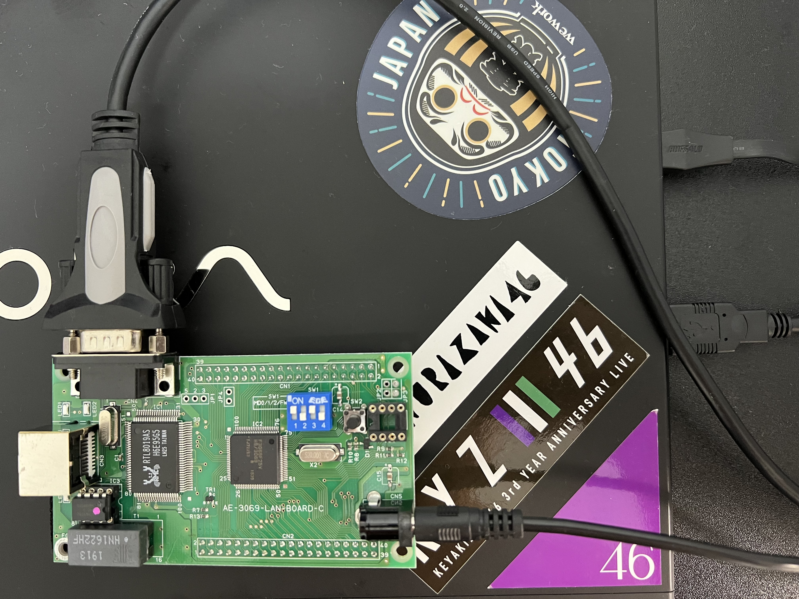

# marinOS

## 開発環境の構築

- 開発環境には [Ubuntu 22.04.1 LTS](https://releases.ubuntu.com/22.04/) on VAIO + [Docker](https://www.docker.com/) (+ macOS) を使用する。
  - なお、Windows10 と Ubuntu 18.04 でデュアルブートしていた VAIO から Windows を消し Ubuntu 18.04 からアップグレードをすると、画面がちらつくようになってしまい、その不具合を修正するのが面倒臭くなったので、同一ネットワークにいる macOS から ssh して基本的に開発を行う。

- 開発用 Docker Image の作成

```bash
make build
```

- 開発用コンテナを起動

```bash
make run
```

- 事前にコンテナ内で `/home/haytok/src/tools/h8write` に配置されている `h8write.c` をビルドしておく必要がある。

```bash
root@31b84c9c179c:/home/haytok/src/tools/h8write# pwd
/home/haytok/src/tools/h8write
root@31b84c9c179c:/home/haytok/src/tools/h8write# ls
h8write  h8write.c
root@31b84c9c179c:/home/haytok/src/tools/h8write# gcc -o h8write h8write.c
```

- OS のビルドと書き込み用のイメージの作成

```bashroot@31b84c9c179c:/home/haytok/src/sample01/bootload# pwd
/home/haytok/src/sample01/bootload
root@31b84c9c179c:/home/haytok/src/sample01/bootload# ls
Makefile  defines.h  ld.scr  lib.c  lib.h  lib.o  main.c  main.o  serial.c  serial.h  serial.o	startup.o  startup.s  vector.c	vector.o
root@31b84c9c179c:/home/haytok/src/sample01/bootload# make
/usr/local/bin/h8300-elf-gcc vector.o startup.o main.o lib.o serial.o -o kzload -Wall -mh -nostdinc -nostdlib -fno-builtin -static -T ld.scr -L.
cp kzload kzload.elf
/usr/local/bin/h8300-elf-strip kzload
root@31b84c9c179c:/home/haytok/src/sample01/bootload# make image
/usr/local/bin/h8300-elf-objcopy -O srec kzload kzload.mot
```

- OS の書き込み (この際、ディップスイッチは on, on, off, on にしておく必要がある。)

```bash
root@31b84c9c179c:/home/haytok/src/sample01/bootload# pwd
/home/haytok/src/sample01/bootload
root@31b84c9c179c:/home/haytok/src/sample01/bootload# ls
Makefile  defines.h  ld.scr  lib.c  lib.h  lib.o  main.c  main.o  serial.c  serial.h  serial.o	startup.o  startup.s  vector.c	vector.o
root@31b84c9c179c:/home/haytok/src/sample01/bootload# make
/usr/local/bin/h8300-elf-gcc vector.o startup.o main.o lib.o serial.o -o kzload -Wall -mh -nostdinc -nostdlib -fno-builtin -static -T ld.scr -L.
cp kzload kzload.elf
/usr/local/bin/h8300-elf-strip kzload
root@31b84c9c179c:/home/haytok/src/sample01/bootload# make image
/usr/local/bin/h8300-elf-objcopy -O srec kzload kzload.mot
root@31b84c9c179c:/home/haytok/src/sample01/bootload# make write
... (省略)
```

## 開発環境の構成

```bash
「Ubuntu 22.04.1 LTS」 <---(シリアル通信)---> 「H8/3069F ネット対応マイコン LAN ボード (完成品)」
```



### 部品

- [H8/3069F ネット対応マイコン LAN ボード (完成品](https://akizukidenshi.com/catalog/g/gK-01271/)
- [超小型スイッチング AC アダプター5V1A AD-D50P100](https://akizukidenshi.com/catalog/g/gM-06096/)

## シリアル通信を行う方法

- 動作の確認にはシリアルポートにおける入出力を行う端末エミュレータを活用する。具体的には、[C-Kermit](http://www.columbia.edu/kermit/ck90.html) を使用する。

- インストール

```bash
sudo apt update
sudo apt install -y ckermit 
```

- マイコンボードと通信するには以下の `.kermrc` を設定してボーレートやデータ長を定義する必要がある。以下にその例を示す。

```bash
haytok@haytok-VJS132:~/workspace/marinOS$ cat ~/.kermrc
set line /dev/ttyUSB0
set speed 9600
set serial 8N1
set stop-bits 1
set flow-control none
set parity none
set carrier-watch off
```

## シリアルポートに関する設定

- `/dev/ttyUSB0` に適切な権限を付与しないと以下のような `/dev/ttyUSB0: Permission denied` というエラーが生じる。

```bash
haytok@haytok-VJS132:~$ kermit
/dev/ttyUSB0: Permission denied
?SET SPEED has no effect without prior SET LINE
C-Kermit 9.0.305 OPEN SOURCE: Alpha.07, 24 Jan 2022, for Linux+SSL (64-bit)
 Copyright (C) 1985, 2022,
  Trustees of Columbia University in the City of New York.
Type ? or HELP for help.
(~/) C-Kermit>q
```

- そのため、「[Ubuntuからコンソール接続する](https://qiita.com/hachisukansw/items/0dcbd9dc5f54e88160c3)」を参考に適切な権限を付与する。この設定はホストの Ubuntu 22.04 で実行する。

```bash
haytok@haytok-VJS132:~$ ls -Al /dev/ttyUSB0
crw-rw---- 1 root dialout 188, 0  8月 21 23:12 /dev/ttyUSB0
```

- `lsusb` コマンドを実行して、該当するポートの ID を確認する。今回は `Serial (UART)` の表示から `0403:6001` が欲しい情報であることが明らかになった。

```bash
haytok@haytok-VJS132:~$ lsusb
Bus 002 Device 001: ID 1d6b:0003 Linux Foundation 3.0 root hub
Bus 001 Device 003: ID 0408:3020 Quanta Computer, Inc. Front camera
Bus 001 Device 002: ID 0489:e0a4 Foxconn / Hon Hai
Bus 001 Device 004: ID 0403:6001 Future Technology Devices International, Ltd FT232 Serial (UART) IC
Bus 001 Device 001: ID 1d6b:0002 Linux Foundation 2.0 root hub
```

- ルールの作成

```bash
echo 'SUBSYSTEM=="tty", ATTRS{idVendor}=="0403", ATTRS{idProduct}=="6001", MODE="0666"' | sudo tee /etc/udev/rules.d/50-usb-serial.rules
```

- 作成したルールの再読み込み

```bash
sudo udevadm control --reload-rules
```

- 適切な権限 (0666) が付与されているかを確認する。

```bash
haytok@haytok-VJS132:~/workspace/marinOS$ ls -la /dev/ttyUSB0
crw-rw-rw- 1 root dialout 188, 0  8月 23 00:53 /dev/ttyUSB0
```

- これにより、接続が可能になる。マイコンボードのリセットボタンを押下すると、以下のように Hello World が出力される。この際、ディップスイッチは on, off, on, of にしておく必要がある。

```bash
haytok@haytok-VJS132:~$ kermit
C-Kermit 9.0.305 OPEN SOURCE: Alpha.07, 24 Jan 2022, for Linux+SSL (64-bit)
 Copyright (C) 1985, 2022,
  Trustees of Columbia University in the City of New York.
Type ? or HELP for help.
(~/) C-Kermit>c
Connecting to /dev/ttyUSB0, speed 9600
 Escape character: Ctrl-\ (ASCII 28, FS): enabled
Type the escape character followed by C to get back,
or followed by ? to see other options.
----------------------------------------------------
Hello World!
```

## 参考

- [12ステップで作る 組込みOS自作入門](https://kozos.jp/books/makeos)
- [H8/3069 F-ZTATTM ハードウェアマニュアル](http://www.picosystems.net/dl/ds/device/HD64F3069.pdf)

- [DockerでH8/3069Fビルド環境構築](https://qiita.com/mbotsu/items/dcba3f76551902f28bfb)
- [otmb/h83069f](https://registry.hub.docker.com/r/otmb/h83069f)
  - ベースの Docker Image
  - 色々試した結果、このやり方で開発環境を作るのが一番楽やった。
- [h83069f](https://github.com/otmb/h83069f)
  - Docker Image を作成するのためのソースコード
