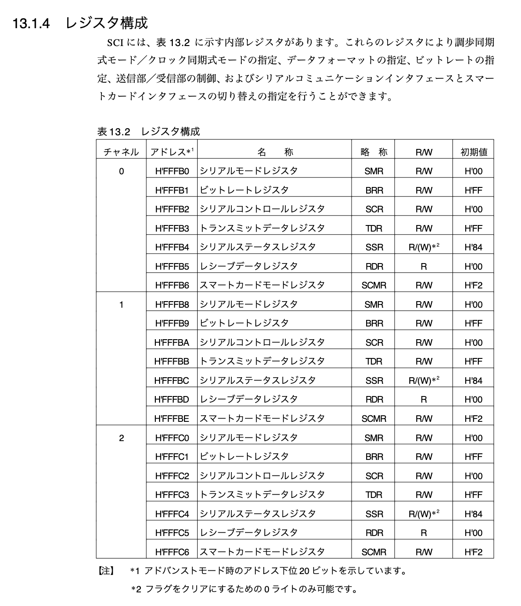

# 概要

- 1 章の実装で気になった箇所のメモを行う。

## メモ

- ? `_start` はリンカスクリプトで結合されたオブジェクトファイルの `vector.c` から呼び出される ???

- `NULL` ってどっかのヘッダファイルで定義されていたものらしい。全く知らんかった ... なので、` #define NULL (void*)0` のようにマクロを定義しないといけない。
  - [NULL | Programming Place Plus　Ｃ言語編　標準ライブラリのリファレンス](https://programming-place.net/ppp/contents/c/appendix/reference/NULL.html)

- `mov.l #0xffff00,sp` はスタックポインタ `sp` に `#0xffff00` を指定している。

- `mov.l` の詳細は以下のドキュメントに記載されている。
  - [5.6.12 命令概要](http://tool-support.renesas.com/autoupdate/support/onlinehelp/ja-JP/csp/V4.01.00/CS+.chm/Compiler-CCRX.chm/Output/ccrx05c0612y.html)
  - -> `l` はサイズを指してたんやな ...

- `#0xffff00` は以下の画像からも確認できるように内蔵 RAM のアドレスを指している。


- `jsr` 命令
  - [JSR](http://tool-support.renesas.com/autoupdate/support/onlinehelp/ja-JP/csp/V4.01.00/CS+.chm/Compiler-CCRX.chm/Output/ccrx05c0613y0029.html)
  > srcが示すサブルーチンへ分岐します。

```
【構文】
JSR src

【オペレーション】
SP = SP - 4;
*SP = ( PC + 2 );（注）
PC = src;

注 (PC + 2)はJSR命令の次の命令の番地です。
 
【機能】
- srcが示すサブルーチンへ分岐します。
```

- `bra` は戻り先アドレスのスタックへの保存などを行わない単純なジャンプの命令である。
- `1b` がそれが書かれた位置よりも前で `1:` がという記述がある箇所で、最も近いものを指す。

- `lib.h` と `lib.c` に実装する関数は `man コマンド` から確認して、定義を逐一確認して、参考にして実装する。

```bash
NAME
       fputc, fputs, putc, putchar, puts - output of characters and strings

SYNOPSIS
       #include <stdio.h>

       int fputc(int c, FILE *stream);

       int fputs(const char *s, FILE *stream);

       int putc(int c, FILE *stream);

       int putchar(int c);

       int puts(const char *s);
```

- シリアル通信と送信元の改行コードは `\n\r` と `\n` を変換する必要がある。
- PC からシリアル通信を行う際は、`\n` を `\r\n` に変換する必要があり、OS からの文字列をシリアル通信を行う際は `\n` から `\r` に変換する必要がある。(参考 p.72, p.73)
  - [Start new line with serial communication](https://stackoverflow.com/questions/11318638/start-new-line-with-serial-communication)

- ? `NULL` や `unsigned char` を定義しないといけないのは、普通の C 言語では `/usr/include/stdint.h` で定義されているため？(こんなこと全く考えたことなかった ...)
  - `man stdint.h` も実行可能。
  - [uint8_t](https://www.wdic.org/w/TECH/uint8_t)
  - `/usr/include/stdint.h` に以下の定義が記載されていた。なので、以下の定義を真似して `unsigned char` と `unsigned short` と `unsigned int` を定義する。

```c
/* Unsigned.  */
typedef unsigned char           uint_least8_t;
typedef unsigned short int      uint_least16_t;
typedef unsigned int            uint_least32_t;
```

- [ ] Makefile を作成して、ビルドできる環境が整ったら、`defines.h` の `#define NULL ((void *)0)` の定義を削除するとどうなるか挙動を確認してみる。ごちゃごちゃ考えてるより試した方が早いと思う。

- `serial_init` の実装に関して
  - シリアルデバイスの設定って何せなあかんか*想像*すると、デバイスを操作するためのアドレスがあって、そこに対して 0 やら 1 を書き込む操作をするんちゃうかな？？？と考えた。その想像で仕様書を眺めてみると、p.513 にシリアルデバイス (SCI : シリアルコミュニケーションインタフェース) のアドレスやレジスタの使用が記載されていたので、このドキュメントをベースに初期化の実装を行う。



| - | チャンネル 0 | チャンネル 1 | チャンネル 2 |
|:-:|:----------:|:-------------:|:------:|
| 先頭アドレス | 0xfffb0 | 0xfffb9 | 0xfffc0 |

- なお、C 言語でアドレスを定義する際は、`0xffffb0` にして `f` を一つ追加する。これは、1 つ上の画像の `0xffffff` に合わせる。

- レジスタは以下の 7 つがある。
  - SMR / BRR / SCR / TDR / SSR / RDR / SCMR
    - SMR (シリアルモードレジスタ)
    - BRR (ビットレートレジスタ)
    - SCR (シリアルコントロールレジスタ)
    - TDR (トランスミットデータレジスタ)
    - SSR (シリアルステータスレジスタ)
    - RDR (レシーブデータレジスタ)
    - SCMR (スマートカードモードレジスタ)
  - なお、アドレスはアドバンストモード時のアドレス下位 20 ビットを示しています。

- 構造体の配列の書き方が一瞬わからんかったけど、以下の記事を参考にしたら書ける。
  - [構造体の配列](http://web.cc.yamaguchi-u.ac.jp/~fukuyo/prog2/603.html)

```c
#include <stdio.h>

struct pop_dt {
    ＜空欄＞
};

int main( void )
{
    struct pop_dt world[]= {
        {"asia", 3769},
        {"north_america", 498},
        {"south_america", 357},
        {"europe", 725},
        {"africa", 832},
        {"oceania", 31},
        {"nowhere", 0}
    };
...
}
```

```c
static struct {
  volatile struct hoge *fuga;
} regs[3] = {
  {
    fuga // 型は volatile struct hoge
  },
  {
    fuga // 型は volatile struct hoge
  },
  {
    fuga // 型は volatile struct hoge
  }
}
```
