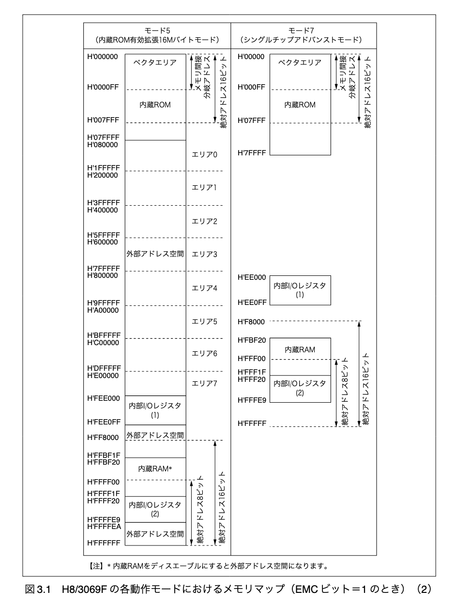
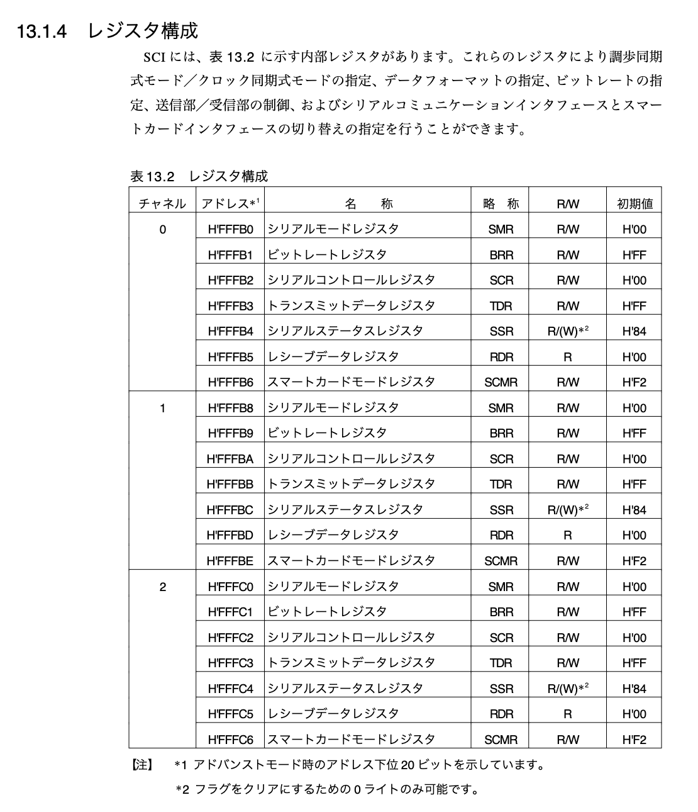
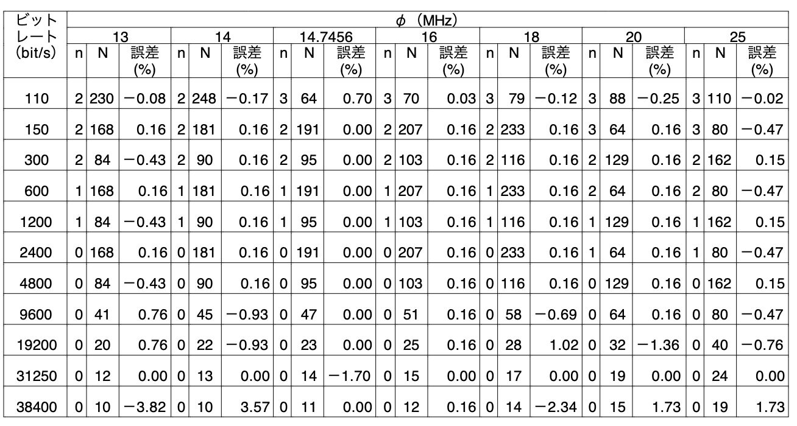

# 概要

- 1 章で実装した結果とそのプロセスにおいて気になった点を Log に残す。

## 実装した結果

```bash
haytok@haytok-VJS132:~$ kermit
Removing stale lock /var/lock/LCK..ttyUSB0 (pid 212941 terminated)
C-Kermit 9.0.305 OPEN SOURCE: Alpha.07, 24 Jan 2022, for Linux+SSL (64-bit)
 Copyright (C) 1985, 2022,
  Trustees of Columbia University in the City of New York.
Type ? or HELP for help.
(~/) C-Kermit>c
Connecting to /dev/ttyUSB0, speed 9600
 Escape character: Ctrl-\ (ASCII 28, FS): enabled
Type the escape character followed by C to get back,
or followed by ? to see other options.
----------------------------------------------------
Hello World :)Hell�Hello World :)Hello World :)Hello World :)Killed
```

- -> 以上の結果より、想定した挙動であることが確認できた :)

## メモ

- ? `_start` はリンカスクリプトで結合されたオブジェクトファイルの `vector.c` から呼び出される ???

- `NULL` ってどっかのヘッダファイルで定義されていたものらしい。全く知らんかった ... なので、` #define NULL (void*)0` のようにマクロを定義しないといけない。
  - [NULL | Programming Place Plus　Ｃ言語編　標準ライブラリのリファレンス](https://programming-place.net/ppp/contents/c/appendix/reference/NULL.html)

- `mov.l #0xffff00,sp` はスタックポインタ `sp` に `#0xffff00` を指定している。

- `mov.l` の詳細は以下のドキュメントに記載されている。
  - [5.6.12 命令概要](http://tool-support.renesas.com/autoupdate/support/onlinehelp/ja-JP/csp/V4.01.00/CS+.chm/Compiler-CCRX.chm/Output/ccrx05c0612y.html)
  - -> `l` はサイズを指してたんやな ...

- `#0xffff00` は以下の画像からも確認できるように内蔵 RAM のアドレスを指している。



- `jsr` 命令
  - [JSR](http://tool-support.renesas.com/autoupdate/support/onlinehelp/ja-JP/csp/V4.01.00/CS+.chm/Compiler-CCRX.chm/Output/ccrx05c0613y0029.html)
  > srcが示すサブルーチンへ分岐します。

```
【構文】
JSR src

【オペレーション】
SP = SP - 4;
*SP = ( PC + 2 );（注）
PC = src;

注 (PC + 2)はJSR命令の次の命令の番地です。
 
【機能】
- srcが示すサブルーチンへ分岐します。
```

- `bra` は戻り先アドレスのスタックへの保存などを行わない単純なジャンプの命令である。
- `1b` がそれが書かれた位置よりも前で `1:` がという記述がある箇所で、最も近いものを指す。

- `lib.h` と `lib.c` に実装する関数は `man コマンド` から確認して、定義を逐一確認して、参考にして実装する。

```bash
NAME
       fputc, fputs, putc, putchar, puts - output of characters and strings

SYNOPSIS
       #include <stdio.h>

       int fputc(int c, FILE *stream);

       int fputs(const char *s, FILE *stream);

       int putc(int c, FILE *stream);

       int putchar(int c);

       int puts(const char *s);
```

- シリアル通信と送信元の改行コードは `\n\r` と `\n` を変換する必要がある。
- PC からシリアル通信を行う際は、`\n` を `\r\n` に変換する必要があり、OS からの文字列をシリアル通信を行う際は `\n` から `\r` に変換する必要がある。(参考 p.72, p.73)
  - [Start new line with serial communication](https://stackoverflow.com/questions/11318638/start-new-line-with-serial-communication)

- ? `NULL` や `unsigned char` を定義しないといけないのは、普通の C 言語では `/usr/include/stdint.h` で定義されているため？(こんなこと全く考えたことなかった ...)
  - `man stdint.h` も実行可能。
  - [uint8_t](https://www.wdic.org/w/TECH/uint8_t)
  - `/usr/include/stdint.h` に以下の定義が記載されていた。なので、以下の定義を真似して `unsigned char` と `unsigned short` と `unsigned int` を定義する。

```c
/* Unsigned.  */
typedef unsigned char           uint_least8_t;
typedef unsigned short int      uint_least16_t;
typedef unsigned int            uint_least32_t;
```

- [ ] Makefile を作成して、ビルドできる環境が整ったら、`defines.h` の `#define NULL ((void *)0)` の定義を削除するとどうなるか挙動を確認してみる。ごちゃごちゃ考えてるより試した方が早いと思う。

- `serial_init` の実装に関して
  - シリアルデバイスの設定って何せなあかんか*想像*すると、デバイスを操作するためのアドレスがあって、そこに対して 0 やら 1 を書き込む操作をするんちゃうかな？？？と考えた。その想像で仕様書を眺めてみると、p.513 にシリアルデバイス (SCI : シリアルコミュニケーションインタフェース) のアドレスやレジスタの使用が記載されていたので、このドキュメントをベースに初期化の実装を行う。



| - | チャンネル 0 | チャンネル 1 | チャンネル 2 |
|:-:|:----------:|:-------------:|:------:|
| 先頭アドレス | 0xfffb0 | 0xfffb9 | 0xfffc0 |

- なお、C 言語でアドレスを定義する際は、`0xffffb0` にして `f` を一つ追加する。これは、1 つ上の画像の `0xffffff` に合わせる。

- レジスタは以下の 7 つがある。
  - SMR / BRR / SCR / TDR / SSR / RDR / SCMR
    - SMR (シリアルモードレジスタ)
    - BRR (ビットレートレジスタ)
    - SCR (シリアルコントロールレジスタ)
    - TDR (トランスミットデータレジスタ)
    - SSR (シリアルステータスレジスタ)
    - RDR (レシーブデータレジスタ)
    - SCMR (スマートカードモードレジスタ)
  - なお、アドレスはアドバンストモード時のアドレス下位 20 ビットを示しています。

- 構造体の配列の書き方が一瞬わからんかったけど、以下の記事を参考にしたら書ける。
  - [構造体の配列](http://web.cc.yamaguchi-u.ac.jp/~fukuyo/prog2/603.html)

```c
#include <stdio.h>

struct pop_dt {
    ＜空欄＞
};

int main( void )
{
    struct pop_dt world[]= {
        {"asia", 3769},
        {"north_america", 498},
        {"south_america", 357},
        {"europe", 725},
        {"africa", 832},
        {"oceania", 31},
        {"nowhere", 0}
    };
...
}
```

```c
static struct {
  volatile struct hoge *fuga;
} regs[3] = {
  {
    fuga // 型は volatile struct hoge
  },
  {
    fuga // 型は volatile struct hoge
  },
  {
    fuga // 型は volatile struct hoge
  }
}
```

14.3.6 データの送信／受信動

- SCI の構造体を初期化する際に、ビット・レート・レジスタに設定する値は仕様書 p.532 と p.686 参照する。(クロック周波数で検索をかけた。)
> 正常に SCI を動作させるために、ホストの転送ビットレートを 9,600bps または 19,200bps に設定してください。

- ホストのビットレートを 9600 bps、動作周波数を 20 MHz にしている。
- -> p.535 の N = 64 の値から brr の値が決まったと考えられる。(以下の画像の表も参考になる。)



- データを送信可能かに関しては仕様書 p.526 に以下の記述があった。
> ビット 7：トランスミットデータレジスタエンプティ（TDRE）
> TDR から TSRにデータ転送が行われ TDRに次のシリアル送信データをライトすることが可能になったことを示します

```c
int serial_is_send_enable(int index)
{
    volatile struct h8_3069f_sci *sci = regs[index].sci;
    return (sci->ssr & (1 << 7));
}
```

- リンカスクリプトに関する情報は本書の p.90 に記載がある。
- データ領域 : `初期値を持つ静的変数` が配置される。
- BSS 領域 : `初期値を持たない静的変数` が配置される。
  - BSS は `Block Started by Symbol` に由来するらしい。
- const で定義した変数や文字列リテラルは `.rodata` セクションに配置される。

- 開発環境のコンテナ内の gcc のバージョン

```bash
root@3056ea74c634:/# /usr/local/bin/h8300-elf-gcc --version
h8300-elf-gcc (GCC) 3.4.6
Copyright (C) 2006 Free Software Foundation, Inc.
This is free software; see the source for copying conditions.  There is NO
warranty; not even for MERCHANTABILITY or FITNESS FOR A PARTICULAR PURPOSE.
```

- -> 3.4.6 やった。

- `man 5 elf` や `readelf コマンド` を活用して自作の ELF ファイル解析ブログラムを実装する。
  - [elf(5) - Linux man page](https://linux.die.net/man/5/elf)

### デバッグに関して

- bootloader が起動を起動させてリセットボタンをポチポチしてもメッセージがコンテナ側に飛んでこないことがあった。原因は以下のように `main 関数` 内呼び出しているシリアル通信の初期化処理にバグがあった。具体的には、`SCR レジスタ`にビットを立てていなかったことである。その際の diff を以下に示す。

```bash
haytok@haytok-VJS132:~/workspace/marinOS$ gd src/01/bootload/serial.c
diff --git a/src/01/bootload/serial.c b/src/01/bootload/serial.c
index 4c9b1a1..96eaa6f 100644
--- a/src/01/bootload/serial.c
+++ b/src/01/bootload/serial.c
@@ -71,7 +71,7 @@ int serial_init(int index)
        sci->smr = 0; // シリアル・モード・レジスタ
        sci->brr = 64; // ビット・レート・レジスタ
        sci->scr = H8_3069F_SCI_SCR_RE |
-                  H8_3069F_SCI_SCR_RE; // 送受信が可能な設定
+                  H8_3069F_SCI_SCR_TE; // 送受信が可能な設定
        sci->ssr = 0; // シリアル・ステータス・レジスタ

        return 0;
```

### Makefile に関して

- `$<` : 最初の依存するファイルの名前を指す。

- 確認の意味を踏まえて、`$<` が何を指すかを `echo コマンド` で出力することにより確認してみた。

```
[root@30a449e0105b bootload]# make
In .c.o, vector.c is  vector.c
/usr/local/bin/h8300-elf-gcc -c -Wall -mh -nostdinc -nostdlib -fno-builtin vector.c
In .s.o, startup.s is  startup.s
/usr/local/bin/h8300-elf-gcc -c -Wall -mh -nostdinc -nostdlib -fno-builtin startup.s
In .c.o, main.c is  main.c
/usr/local/bin/h8300-elf-gcc -c -Wall -mh -nostdinc -nostdlib -fno-builtin main.c
In .c.o, lib.c is  lib.c
/usr/local/bin/h8300-elf-gcc -c -Wall -mh -nostdinc -nostdlib -fno-builtin lib.c
In .c.o, serial.c is  serial.c
```

- -> 結論、`*.c` と `*.s` が出力された。

### Makefile における `$(STRIP) $(TARGET)` に関して

- そもそも strip コマンドとは man には以下のように定義されている。

```bash
STRIP(1)                                                   GNU Development Tools                                                   STRIP(1)

NAME
       strip - discard symbols and other data from object files
```

- -> 対象のファイルからシンボル等を削除するコマンドっぽい。なので、`strip コマンド` の引数に渡している `$(TARGET)` と `$(TARGET).elf` の差分を `diff コマンド` を使用してどのように差があるかを確認してみる。

- 念の為 `diff コマンド` の挙動の確認をしておく。

```bash
haytok@haytok-VJS132:~/workspace/marinOS/src/01/bootload$ cat a
a
b
haytok@haytok-VJS132:~/workspace/marinOS/src/01/bootload$ cat b
b
haytok@haytok-VJS132:~/workspace/marinOS/src/01/bootload$ diff --text -u b a
--- b	2022-09-02 00:27:29.627812676 +0900
+++ a	2022-09-02 00:27:25.227808017 +0900
@@ -1 +1,2 @@
+a
 b
```

- 内容が多い方を後ろの引数に渡すと、多い内容が + で出力される。

- 以上を踏まえて `kzload` と `kzload.elf` の差分を確認してみる。

```bash
haytok@haytok-VJS132:~/workspace/marinOS/src/01/bootload$ diff --text -u kzload kzload.elf
--- kzload	2022-09-02 00:20:39.587095191 +0900
+++ kzload.elf	2022-09-02 00:20:39.587095191 +0900
@@ -1,3 +1,5 @@
-ELF.4t�4 (t��?��

                  z��^
                      @�m��y^�z�^\@�m��n���nj���
+ELF.4��4 t��@��

                 z��^
                     @�m��y^�z�^\@�m��n���nj���
 F
 ^Lni��y^L
 �mvTpm��o���ob��h*
                   �G�i#h8
                          i�^&@�"
 �mvTpm��o���ob���22z�i"o���oc���n�oc���h�oc���@n�oc���0n�oc���n�"
 �
  �mvTpm��o���ob���22z�i"o���ob��n*Ryb�
 �
 F@�oc��nj��n�o`��ob���n*�n�"���o`��^
 �
  �mvTpHello World :)���������.shstrtab.vectors.text.rodata.data
                                                                tt��0"�?
                                                                        K(
\ No newline at end of file
 ^Lni��y^L
 �mvTpm��o���ob��h*
                   �G�i#h8
                          i�^&@�"
 �mvTpm��o���ob���22z�i"o���oc���n�oc���h�oc���@n�oc���0n�oc���n�"
 �
  �mvTpm��o���ob���22z�i"o���ob��n*Ryb�
 �
 F@�oc��nj��n�o`��ob���n*�n�"���o`��^
 �
  �mvTpHello World :)���������.symtab.strtab.shstrtab.vectors.text.rodata.datat$t�*�02�@
                                                                                        L8��	d�����
+
+���$ ��D&�*j.��7�
                  &�*x=F&6L\<Dip�p}Lp�
                                      vector.c.L11main.c.LC0.L2lib.c.L5.L4serial.c_regs_vectors_putc_puts_serial_is_send_enable_start_serial_init_serial_send_byte_main
\ No newline at end of file
```

- -> 確かに `kzload.elf` の方がシンボルの内容は多そうな感じは確認できた。

### $(OBJCOPY) -O srec $(TARGET) $(TARGET).mot に関して

```bash
OBJCOPY(1)                                                 GNU Development Tools                                                 OBJCOPY(1)

NAME
       objcopy - copy and translate object files

...

DESCRIPTION
       The GNU objcopy utility copies the contents of an object file to another.  objcopy uses the GNU BFD Library to read and write the
       object files.  It can write the destination object file in a format different from that of the source object file.  The exact
       behavior of objcopy is controlled by command-line options.  Note that objcopy should be able to copy a fully linked file between any
       two formats. However, copying a relocatable object file between any two formats may not work as expected.

       objcopy creates temporary files to do its translations and deletes them afterward.  objcopy uses BFD to do all its translation work;
       it has access to all the formats described in BFD and thus is able to recognize most formats without being told explicitly.

       objcopy can be used to generate S-records by using an output target of srec (e.g., use -O srec).
```

- -> つまり、objcopy はターゲットを srec に指定する (つまり -O srec とする) ことによって S-record を生成することもできる。 

- -> S-record は `Motorola S-record` のことを指しているっぽくて、マイコンの ROM に書き込むための形式に変換するために `objcopy -O srec` コマンドを使用している。
  - [S-record](https://ja.wikipedia.org/wiki/S-record)
