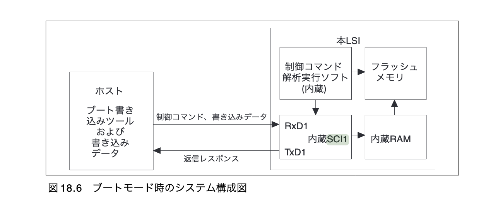

# 概要

- 2 章で実装した結果とそのプロセスにおいて気になった点を Log に残す。

## 本章で実装すること

- ライブラリ関数と 16 進数を出力する関数の追加
  - `memset() 関数`
  - `memcpy() 関数`
  - `memcmp() 関数`
  - `strlen() 関数`
  - `srtcpy() 関数`
  - `strncmp() 関数`
  - `memset() 関数`
  - `putxval() 関数`
- シリアル通信で 16 進数を出力す流処理の実装

## 実装した結果

- Currently being implemented ... 

<!-- ```bash
haytok@haytok-VJS132:~$ kermit
Removing stale lock /var/lock/LCK..ttyUSB0 (pid 212941 terminated)
C-Kermit 9.0.305 OPEN SOURCE: Alpha.07, 24 Jan 2022, for Linux+SSL (64-bit)
 Copyright (C) 1985, 2022,
  Trustees of Columbia University in the City of New York.
Type ? or HELP for help.
(~/) C-Kermit>c
Connecting to /dev/ttyUSB0, speed 9600
 Escape character: Ctrl-\ (ASCII 28, FS): enabled
Type the escape character followed by C to get back,
or followed by ? to see other options.
----------------------------------------------------
Hello World :)Hell�Hello World :)Hello World :)Hello World :)Killed
``` -->

<!-- - -> 以上の結果より、想定した挙動であることが確認できた :) -->

## メモ

- シリアル通信によるデータ転送の制御を CPU がソフトウェア的に行うのは現実的に厳しい。そのため、シリアル通信の制御を行うための IC チップを一般的にコントローラと呼ぶ。通信の信号の制御はコントローラが行うため、CPU からはコントローラに対してデータの送信要求を出したり、コントローラからデータを受信したりするだけで済むようになる。
- なお、シリアル・コントローラなら、コントローラの持つ特定のレジスタに 1 byte を書き込むと、あとはコントローラ側でその 1 byte をシリアル送信する。

- H8/3069F マイコン・ボードのシリアルコネクタには SCI が接続されているため、SCI1 を操作することでシリアル経由での入出力を行える。 (書籍 p.64)



- 32 bit CPU では、int 型も long 型も 32 bit である。
  - [第 7 章 64 ビット環境に対応するアプリケーションへの変換](https://docs.oracle.com/cd/E19205-01/820-1209/bjami/index.html)
- 当該マイコン・ボードは 16 bit であるので、int 型も 16 bit となるが、メモリサイズを指す値としては今後プログラムサイズが巨大になって行った時に、狭くなってしまう可能性がある。そのため、細部に関しては

- [ＣＰＵ編 -  最近よく使うＣＰＵ](http://www.rexfirm.co.jp/column.htm)
> 「当然ですがH8系はint=16Bit ...」

- [ポートを使いこなし、いざ制御プログラミングの世界へ](https://monoist.itmedia.co.jp/mn/articles/0911/18/news098_3.html)

- [H8プログラミングメモ - H8マイコン](https://bluefish.orz.hm/sdoc/h8_prog.html)

# ライブラリ関数の実装に関して

- 全般的にエラーハンドリングが足りていないので、今後の課題としたい。また、自作ライブラリ関数のテストの実装と、glibc 等のライブラリ関数の実装も参考にする。

- `void *memset(void *s, int c, long len)`

```bash
DESCRIPTION
       The memset() function fills the first n bytes of the memory area pointed to by s with the constant byte c.

RETURN VALUE
       The memset() function returns a pointer to the memory area s.
```

- `void *memcpy(void *dest, const void *src, long n)`

```bash
DESCRIPTION
       The  memcpy()  function copies n bytes from memory area src to memory area dest.  The memory areas must not overlap.  Use memmove(3)
       if the memory areas do overlap.

RETURN VALUE
       The memcpy() function returns a pointer to dest.
```

- `int memcmp(const void *dest, const void *src, long n)`

```bash
DESCRIPTION
       The memcmp() function compares the first n bytes (each interpreted as unsigned char) of the memory areas s1 and s2.

RETURN VALUE
       The  memcmp()  function  returns  an  integer less than, equal to, or greater than zero if the first n bytes of s1 is found, respectively, to be less than, to match, or be greater than the first n bytes of s2.

       For a nonzero return value, the sign is determined by the sign of the difference between the first pair of bytes (interpreted as unsigned char) that differ in s1 and s2.

       If n is zero, the return value is zero.
```

- `int strlen(const char *s)`

```bash
DESCRIPTION
       The strlen() function calculates the length of the string pointed to by s, excluding the terminating null byte ('\0').

RETURN VALUE
       The strlen() function returns the number of bytes in the string pointed to by s.
```

- `char *strcpy(char *dest, const char *src)`

```bash
DESCRIPTION
       The  strcpy()  function copies the string pointed to by src, including the terminating null byte ('\0'), to the buffer pointed to by
       dest.  The strings may not overlap, and the destination string dest must be large enough to receive  the  copy.   Beware  of  buffer
       overruns!  (See BUGS.)

       The strncpy() function is similar, except that at most n bytes of src are copied.  Warning: If there is no null byte among the first
       n bytes of src, the string placed in dest will not be null-terminated.

       If the length of src is less than n, strncpy() writes additional null bytes to dest to ensure that a total of n bytes are written.

       A simple implementation of strncpy() might be:

           char *
           strncpy(char *dest, const char *src, size_t n)
           {
               size_t i;

               for (i = 0; i < n && src[i] != '\0'; i++)
                   dest[i] = src[i];
               for ( ; i < n; i++)
                   dest[i] = '\0';

               return dest;
           }

RETURN VALUE
       The strcpy() and strncpy() functions return a pointer to the destination string dest.
```

- 

```bash

```

- 

```bash

```

- 

```bash

```

- 

```bash

```

## `strcpy 関数` のデバッグに関して

### 問題

- 以下のようなプログラムを実行したところ、セグフォが発生した。

```c
#include <stdio.h>

char *original_strcpy(char *dest, const char *src)
{
	char *d = dest;
	int i = 0;
	for (;; dest++, src++)
	{
		*dest = *src;
		if (!*src)
			break;
	}
	return d;
}

int main(void)
{
	char *dest = "fuga";
	const char *src = "hogehoge";
	char *tmp = "hoge";
	*dest = *tmp;
	printf("%s\n", dest);
	char *hoge = fuga(dest, src);
	printf("%s\n", dest);
}
```

- ダンプファイルと gdb を使用してデバッグを実施する。この際、実行ファイルを作成する際に、`-g` をつけるのを忘れないようにする。(このオプションをつけ忘れていたせいでデバッグができなかった ...)

```bash
haytok@haytok-VJS132:~$ gdb main core.6431
GNU gdb (Ubuntu 12.0.90-0ubuntu1) 12.0.90
Copyright (C) 2022 Free Software Foundation, Inc.
License GPLv3+: GNU GPL version 3 or later <http://gnu.org/licenses/gpl.html>
This is free software: you are free to change and redistribute it.
There is NO WARRANTY, to the extent permitted by law.
Type "show copying" and "show warranty" for details.
This GDB was configured as "x86_64-linux-gnu".
Type "show configuration" for configuration details.
For bug reporting instructions, please see:
<https://www.gnu.org/software/gdb/bugs/>.
Find the GDB manual and other documentation resources online at:
    <http://www.gnu.org/software/gdb/documentation/>.

For help, type "help".
Type "apropos word" to search for commands related to "word"...
Reading symbols from main...
[New LWP 6431]
[Thread debugging using libthread_db enabled]
Using host libthread_db library "/lib/x86_64-linux-gnu/libthread_db.so.1".
Core was generated by `./main'.
Program terminated with signal SIGSEGV, Segmentation fault.
#0  0x000055b9b1977354 in main () at main.c:57
57		*dest = *tmp;
(gdb)
```

- -> `*dest = *tmp;` の実装が問題だったぽい。

- この問題の原因は以下の記事から明らかになった。

- [#C よく見る"Bus error: 10"の原因追求](https://qiita.com/comcha/items/269280f99c61062bf3cf)
> 原因は文字列リテラルとコンパイラの関係みたいで、
> - ポインタ変数に文字列リテラルを直接設定すると、変更（上書き）ができない
> - 配列にすると自由に書き換え可能

- -> 確かに、そういや C 言語って文字列の扱いが結構面倒臭かったな ...

- 以下の記事を見ると、なんでエラーになるかがわかる。
  - [C言語と文字列に関するあれこれ](https://qiita.com/kaityo256/items/6ca69143901a02b32a85)

- -> `char *dest = "fuga";` や `const char *src = "hogehoge";` はコンパイラ (gcc) が文字列の実態を `.secton .rodata` を配置するために今回のエラーが発生していた。読み込みしかできないセグメントに配置されるため、書き込みができないことがわかって、すごいスッキリした。確かにぃぃぃぃぃってなった :)

- -> 別の観点からの話をすると、以下のような `tmp 変数` で定義した文字列は `main 関数` から読み出すことができる。これは、`tmp 変数` に格納されている文字列が `.rodata` に格納されているためである。

```c
#include <stdio.h>

char *test()
{
	char *tmp = "tmp";
	return tmp;
}

int main(void)
{
	char *t = test();
	printf("t %s\n", t);
}
```

- -> そのため、アセンブリ言語 (`main.s`) の `.secton .rodata` を `.data` に書き換えるとプログラムの実行が可能になる。

- -> ちなみに、`-Wall` オプションをつけてもセグフォの原因を拾うことができなかった。参考の記事にもあるように他のコンパイラを使用すると、救えることもあるかもしれない。コンパイラが適宜良くない宣言等をひろって欲しいところやな ...

- 結論 : `strcpy 関数` を呼び出す際の第一引数 `dest 変数` に問題があった。[glibc のドキュメント](https://www.gnu.org/software/libc/manual/html_mono/libc.html) にもあるように第一引数には配列を指定する必要がある。`char *` の変数を指定すると、`.rodata` の観点からセグフォが発生してしまう。
  > The array arguments and return values for these functions have type char * and wchar_t * respectively, and the array elements are referred to as “bytes” and “wide characters”. 

- 今後の方針
  - よくよく考えると、`strcpy 関数` の基本的な使い方も知らないので、具体的な使い方を調査しつつテストコードを追加する。

## 手元の glibc のバージョンの確認

```bash
haytok@haytok-VJS132:~$ /lib64/ld-linux-x86-64.so.2 --version
ld.so (Ubuntu GLIBC 2.35-0ubuntu3.1) stable release version 2.35.
Copyright (C) 2022 Free Software Foundation, Inc.
This is free software; see the source for copying conditions.
There is NO warranty; not even for MERCHANTABILITY or FITNESS FOR A
PARTICULAR PURPOSE.
```

- -> `version 2.35` やった。

## `strcpy 関数` の定義を再確認

- [The GNU C Library - 5.2 String and Array Conventions](https://www.gnu.org/software/libc/manual/html_mono/libc.html)
- [【C言語】strcpy関数／strncpy関数【詳解｜危険性と注意点 strlcpyの脆弱性】](https://marycore.jp/prog/c-lang/string-strcpy-strncpy/)

- テストコードとかチラッと読んでみたけど、どうやってテストしてるかいまいちわからんかった。
- [test-strcpy.c](https://sourceware.org/git/?p=glibc.git;a=blob;f=string/test-strcpy.c;h=83b77073bbf2ffa037b7d98d51d20e4eae5df9a5;hb=f94f6d8a3572840d3ba42ab9ace3ea522c99c0c2)

## 実装とテスト

1. 一般的な関数
  - [ ] 挙動を確認
  - [ ] 簡単なテストを実装
2. 自作の関数
  - [ ] 挙動を確認
  - [ ] 簡単なテストを実装
3. (glibc で使用されているテストを Pass させたい ...)

### `memset 関数`

- [memset](http://www9.plala.or.jp/sgwr-t/lib/memset.html)

```bash
NAME
       memset - fill memory with a constant byte

SYNOPSIS
       #include <string.h>

       void *memset(void *s, int c, size_t n);

DESCRIPTION
       The memset() function fills the first n bytes of the memory area pointed to by s with the constant byte c.

RETURN VALUE
       The memset() function returns a pointer to the memory area s.
```

#### 参考
  > mem系の関数は、文字列というよりメモリブロックを処理対象にしています。そのため、あらゆる型での処理が可能になります。ですから、戻り値や引数も汎用ポインタ型である「void *」を用います。

### `memcpy 関数`

- [memcpy](http://www9.plala.or.jp/sgwr-t/lib/memcpy.html)

```bash
SYNOPSIS
       #include <string.h>

       void *memcpy(void *dest, const void *src, size_t n);

DESCRIPTION
       The  memcpy()  function copies n bytes from memory area src to memory area dest.  The memory areas must not overlap.  Use memmove(3)
       if the memory areas do overlap.

RETURN VALUE
       The memcpy() function returns a pointer to dest.
```

- -> オーバーラップしたらあかんって man に書いてある。
- 新しい挑戦として関数ポインタを使用してテストを実装してみた。(アセンブリ言語から関数ポインタの存在は認知していた。)
  - [C言語の関数ポインタの使い方](https://yu-nix.com/archives/c-function-pointer/#C%E8%A8%80%E8%AA%9E%E3%81%AE%E9%96%A2%E6%95%B0%E3%83%9D%E3%82%A4%E3%83%B3%E3%82%BF%E3%81%AE%E4%BD%BF%E3%81%84%E6%96%B9)

### `memcmp 関数`

- [memcmp](http://www9.plala.or.jp/sgwr-t/lib/memcmp.html)

```bash
DESCRIPTION
       The memcmp() function compares the first n bytes (each interpreted as unsigned char) of the memory areas s1 and s2.

RETURN VALUE
       The  memcmp()  function  returns  an  integer less than, equal to, or greater than zero if the first n bytes of s1 is found, respec‐
       tively, to be less than, to match, or be greater than the first n bytes of s2.

       For a nonzero return value, the sign is determined by the sign of the difference between the first pair of bytes (interpreted as un‐
       signed char) that differ in s1 and s2.

       If n is zero, the return value is zero.
```

### `strlen 関数`

- [strlen](http://www9.plala.or.jp/sgwr-t/lib/strlen.html)
  - -> 本来やと glibc のドキュメントを逐一確認せなあかんとこやけど、このサイトが割と信用できそうなので、man を確認しつつこのサイトでサンプルを確認する。

### `strcpy 関数`

- [strcpy](http://www9.plala.or.jp/sgwr-t/lib/strcpy.html)
  - dest の変数は `char []` である必要がある。src に関しては `char []` でも `char *` でも問題ない。

### `strcmp 関数`

- [strncmp](http://www9.plala.or.jp/sgwr-t/lib/strncmp.html)

```
DESCRIPTION
       The  strcmp() function compares the two strings s1 and s2.  The locale is not taken into account (for a locale-aware comparison, see
       strcoll(3)).  The comparison is done using unsigned characters.

       strcmp() returns an integer indicating the result of the comparison, as follows:

       • 0, if the s1 and s2 are equal;

       • a negative value if s1 is less than s2;

       • a positive value if s1 is greater than s2.

       The strncmp() function is similar, except it compares only the first (at most) n bytes of s1 and s2.

RETURN VALUE
       The strcmp() and strncmp() functions return an integer less than, equal to, or greater than  zero  if  s1  (or  the  first  n  bytes
       thereof) is found, respectively, to be less than, to match, or be greater than s2.
```
