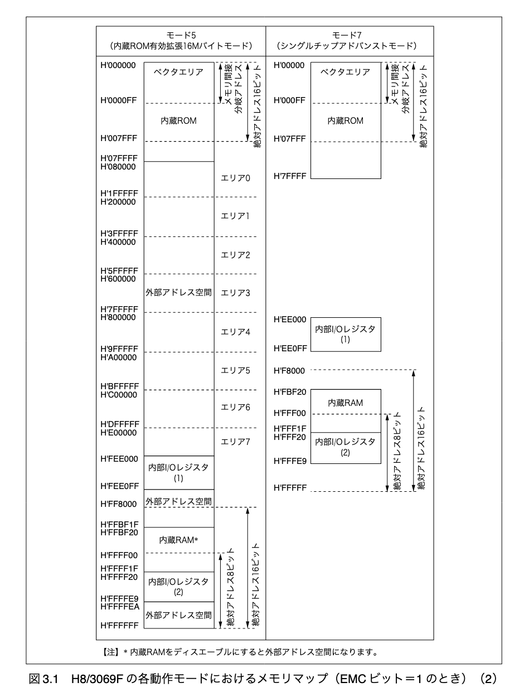

# 概要

- 3 章で実装した結果とそのプロセスにおいて気になった点を Log に残す。

## 本章で実装すること

- 以下のような main 関数を実装した際に、value の値を書き換えられない。

```c
volatile int value = 10;

int main(void)
{
... (省略)

	// 検証 (変数 value が書き換えられないことを確認する)
	putxval(value, 0);
	PRINT_NEWLINE();
	value = 11;
	putxval(value, 0);

... (省略)
}
```

- 通信した結果、`b` の出力を得られることを期待したが、変数の書き換えが行われず `a` の出力が得られた。

```bash
aytok@haytok-VJS132:~/workspace/marinOS$ kermit                       
Removing stale lock /var/lock/LCK..ttyUSB0 (pid 31373 terminated)      
C-Kermit 9.0.305 OPEN SOURCE: Alpha.07, 24 Jan 2022, for Linux+SSL (64-bit)                                                                   
 Copyright (C) 1985, 2022,                                             
  Trustees of Columbia University in the City of New York.             
Type ? or HELP for help.                                               
(~/workspace/marinOS/) C-Kermit>c                                      
Connecting to /dev/ttyUSB0, speed 9600                                 
 Escape character: Ctrl-\ (ASCII 28, FS): enabled                      
Type the escape character followed by C to get back,                   
or followed by ? to see other options.                                 
----------------------------------------------------                   
Hello World :)                                                         
0a0                                                                    
a                                                                      
a
```

- -> これまで実装したプログラムが ROM に書き込んでいるため、値の変更が不可能だった。そのため、静的変数を ROM ではなく RAM に配置するようにして変数を変更できるようにリンカスクリプトを調整する必要がある。

## 実装した結果

- Currently being implemented ...

## メモ

- `strip コマンド` により、`kzload.elf` ファイルからデバッグ情報等の不要な情報を削除してサイズを削減できる。

- `readelf -a kozos.elf` を実行した結果を以下に示す。

```bash
[root@cbb840558b6b bootload]# readelf -a kzload.elf
ELF Header:
  Magic:   7f 45 4c 46 01 02 01 00 00 00 00 00 00 00 00 00
  Class:                             ELF32
  Data:                              2's complement, big endian
  Version:                           1 (current)
  OS/ABI:                            UNIX - System V
  ABI Version:                       0
  Type:                              EXEC (Executable file)
  Machine:                           Renesas H8/300
  Version:                           0x1
  Entry point address:               0x100
  Start of program headers:          52 (bytes into file)
  Start of section headers:          2280 (bytes into file)
  Flags:                             0x810000
  Size of this header:               52 (bytes)
  Size of program headers:           32 (bytes)
  Number of program headers:         2
  Size of section headers:           40 (bytes)
  Number of section headers:         8
  Section header string table index: 5

Section Headers:
  [Nr] Name              Type            Addr     Off    Size   ES Flg Lk Inf Al
  [ 0]                   NULL            00000000 000000 000000 00      0   0  0
  [ 1] .vectors          PROGBITS        00000000 000074 000100 00  WA  0   0  4
  [ 2] .text             PROGBITS        00000100 000174 000706 00  AX  0   0  2
  [ 3] .rodata           PROGBITS        00000806 00087a 000023 00   A  0   0  1
  [ 4] .data             PROGBITS        0000082c 0008a0 000010 00  WA  0   0  4
  [ 5] .shstrtab         STRTAB          00000000 0008b0 000038 00      0   0  1
  [ 6] .symtab           SYMTAB          00000000 000a28 000460 10      7  53  4
  [ 7] .strtab           STRTAB          00000000 000e88 000186 00      0   0  1
Key to Flags:
  W (write), A (alloc), X (execute), M (merge), S (strings)
  I (info), L (link order), G (group), T (TLS), E (exclude), x (unknown)
  O (extra OS processing required) o (OS specific), p (processor specific)

There are no section groups in this file.

Program Headers:
  Type           Offset   VirtAddr   PhysAddr   FileSiz MemSiz  Flg Align
  LOAD           0x000074 0x00000000 0x00000000 0x00829 0x00829 RWE 0x1
  LOAD           0x0008a0 0x0000082c 0x0000082c 0x00010 0x00010 RW  0x1

 Section to Segment mapping:
  Segment Sections...
   00     .vectors .text .rodata
   01     .data

There is no dynamic section in this file.

There are no relocations in this file.

There are no unwind sections in this file.

Symbol table '.symtab' contains 70 entries:
   Num:    Value  Size Type    Bind   Vis      Ndx Name
     0: 00000000     0 NOTYPE  LOCAL  DEFAULT  UND
     1: 00000000     0 SECTION LOCAL  DEFAULT    1
     2: 00000100     0 SECTION LOCAL  DEFAULT    2
     3: 00000806     0 SECTION LOCAL  DEFAULT    3
     4: 0000082c     0 SECTION LOCAL  DEFAULT    4
     5: 00000000     0 FILE    LOCAL  DEFAULT  ABS vector.c
     6: 0000010a     0 NOTYPE  LOCAL  DEFAULT    2 .L1^B1
     7: 00000000     0 FILE    LOCAL  DEFAULT  ABS main.c
     8: 00000806     0 NOTYPE  LOCAL  DEFAULT    3 .LC0
     9: 00000816     0 NOTYPE  LOCAL  DEFAULT    3 .LC1
    10: 0000016e     0 NOTYPE  LOCAL  DEFAULT    2 .L2
    11: 00000000     0 FILE    LOCAL  DEFAULT  ABS lib.c
    12: 0000018e     0 NOTYPE  LOCAL  DEFAULT    2 .L2
    13: 000001d6     0 NOTYPE  LOCAL  DEFAULT    2 .L5
    14: 000001b4     0 NOTYPE  LOCAL  DEFAULT    2 .L4
    15: 0000023e     0 NOTYPE  LOCAL  DEFAULT    2 .L8
    16: 00000252     0 NOTYPE  LOCAL  DEFAULT    2 .L10
    17: 000002a4     0 NOTYPE  LOCAL  DEFAULT    2 .L9
    18: 00000818     0 NOTYPE  LOCAL  DEFAULT    3 .LC0
    19: 00000320     0 NOTYPE  LOCAL  DEFAULT    2 .L14
    20: 000002ea     0 NOTYPE  LOCAL  DEFAULT    2 .L13
    21: 000003b2     0 NOTYPE  LOCAL  DEFAULT    2 .L18
    22: 0000036e     0 NOTYPE  LOCAL  DEFAULT    2 .L17
    23: 000003fc     0 NOTYPE  LOCAL  DEFAULT    2 .L21
    24: 00000496     0 NOTYPE  LOCAL  DEFAULT    2 .L20
    25: 00000490     0 NOTYPE  LOCAL  DEFAULT    2 .L23
    26: 00000464     0 NOTYPE  LOCAL  DEFAULT    2 .L25
    27: 00000452     0 NOTYPE  LOCAL  DEFAULT    2 .L26
    28: 0000045a     0 NOTYPE  LOCAL  DEFAULT    2 .L27
    29: 00000414     0 NOTYPE  LOCAL  DEFAULT    2 .L22
    30: 000004ec     0 NOTYPE  LOCAL  DEFAULT    2 .L30
    31: 000004ca     0 NOTYPE  LOCAL  DEFAULT    2 .L29
    32: 00000540     0 NOTYPE  LOCAL  DEFAULT    2 .L34
    33: 0000055e     0 NOTYPE  LOCAL  DEFAULT    2 .L33
    34: 00000522     0 NOTYPE  LOCAL  DEFAULT    2 .L32
    35: 000005a4     0 NOTYPE  LOCAL  DEFAULT    2 .L39
    36: 00000606     0 NOTYPE  LOCAL  DEFAULT    2 .L38
    37: 000005e8     0 NOTYPE  LOCAL  DEFAULT    2 .L40
    38: 000005d6     0 NOTYPE  LOCAL  DEFAULT    2 .L41
    39: 000005de     0 NOTYPE  LOCAL  DEFAULT    2 .L42
    40: 0000060c     0 NOTYPE  LOCAL  DEFAULT    2 .L36
    41: 0000058a     0 NOTYPE  LOCAL  DEFAULT    2 .L37
    42: 00000654     0 NOTYPE  LOCAL  DEFAULT    2 .L46
    43: 000006cc     0 NOTYPE  LOCAL  DEFAULT    2 .L45
    44: 000006a2     0 NOTYPE  LOCAL  DEFAULT    2 .L47
    45: 00000690     0 NOTYPE  LOCAL  DEFAULT    2 .L48
    46: 00000698     0 NOTYPE  LOCAL  DEFAULT    2 .L49
    47: 000006d2     0 NOTYPE  LOCAL  DEFAULT    2 .L43
    48: 00000638     0 NOTYPE  LOCAL  DEFAULT    2 .L44
    49: 00000000     0 FILE    LOCAL  DEFAULT  ABS serial.c
    50: 00000830    12 OBJECT  LOCAL  DEFAULT    4 _regs
    51: 000007d2     0 NOTYPE  LOCAL  DEFAULT    2 .L5
    52: 000007c2     0 NOTYPE  LOCAL  DEFAULT    2 .L4
    53: 00000572   170 NOTYPE  GLOBAL DEFAULT    2 _strcmp
    54: 00000000   256 OBJECT  GLOBAL DEFAULT    1 _vectors
    55: 00000170    54 NOTYPE  GLOBAL DEFAULT    2 _putc
    56: 000001a6    60 NOTYPE  GLOBAL DEFAULT    2 _puts
    57: 0000082c     2 OBJECT  GLOBAL DEFAULT    4 _value
    58: 00000752    68 NOTYPE  GLOBAL DEFAULT    2 _serial_is_send_enable
    59: 00000334   150 NOTYPE  GLOBAL DEFAULT    2 _memcpy
    60: 000002c2   114 NOTYPE  GLOBAL DEFAULT    2 _memset
    61: 00000100     0 NOTYPE  GLOBAL DEFAULT    2 _start
    62: 000006e2   112 NOTYPE  GLOBAL DEFAULT    2 _serial_init
    63: 000001e2   224 NOTYPE  GLOBAL DEFAULT    2 _putxval
    64: 000004fe   116 NOTYPE  GLOBAL DEFAULT    2 _strcpy
    65: 000003ca   220 NOTYPE  GLOBAL DEFAULT    2 _memcmp
    66: 0000061c   198 NOTYPE  GLOBAL DEFAULT    2 _strncmp
    67: 000004a6    88 NOTYPE  GLOBAL DEFAULT    2 _strlen
    68: 00000796   112 NOTYPE  GLOBAL DEFAULT    2 _serial_send_byte
    69: 0000010c   100 NOTYPE  GLOBAL DEFAULT    2 _main

No version information found in this file.
```


