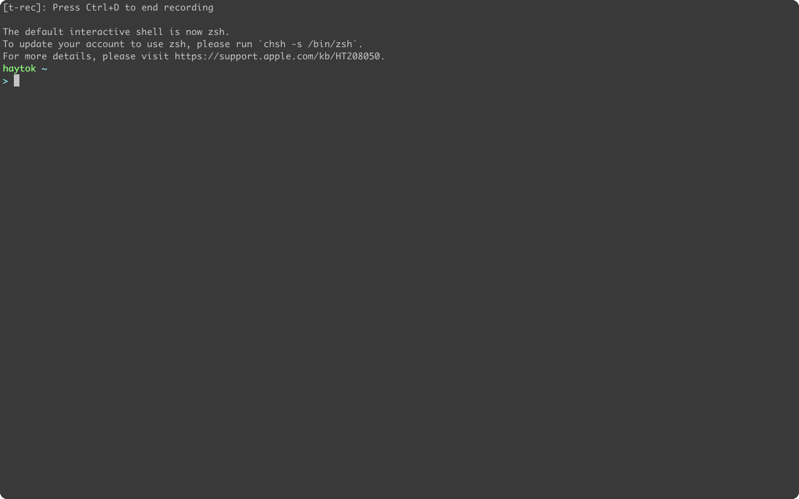

# 概要

- 4 章で実装した結果とそのプロセスにおいて気になった点を Log に残す。

## 本章で実装すること

- 受信用のドライバを実装する。
- ファイル転送プロトコル XMODEM プロトコルを実装し、指定した RAM の領域にデータを書き込む。

## 実装した結果

- bootloader と OS は書き込んだ後の操作

1. kermit で マイコンとシリアル通信をできるようにする。(`c コマンドの実行`)
2. `load コマンド` をマイコン側に送信し、XMODEM プロトコルでファイルを転送できる待機状態にさせる。
3. `[caps lock] + \` を押下したのちに `c` を実行して一旦入力状態から離れる。
4. ファイル転送コマンド `send defines.h` を実行する。そうすると、ファイルの転送が開始する。(体感、この時間はわりと長かった。)
5. 再度、`c コマンド` を実行してコマンドを送信できるような状態に戻り、`dump コマンド` を実行すると、`buffer 領域` に書き込まれたデータを読み出す。この結果と転送元のファイルの `hexdump -C <ファイル名>` を実行することで、適切にファイルが転送されているかを確認することができる。

```bash
haytok@haytok-VJS132:~/workspace/marinOS/src/04/bootload$ kermit
Removing stale lock /var/lock/LCK..ttyUSB0 (pid 69386 terminated)
C-Kermit 9.0.305 OPEN SOURCE: Alpha.07, 24 Jan 2022, for Linux+SSL (64-bit)
 Copyright (C) 1985, 2022,
  Trustees of Columbia University in the City of New York.
Type ? or HELP for help.
(~/workspace/marinOS/src/04/bootload/) C-Kermit>c
Connecting to /dev/ttyUSB0, speed 9600
 Escape character: Ctrl-\ (ASCII 28, FS): enabled
Type the escape character followed by C to get back,
or followed by ? to see other options.
----------------------------------------------------

unknown.
marinos> load

(Back at haytok-VJS132)
----------------------------------------------------
(~/workspace/marinOS/src/04/bootload/) C-Kermit>send defines.h
Sending /home/haytok/workspace/marinOS/src/04/bootload/defines.h, 1 blocks: Give your local XMODEM receive command now.
Xmodem sectors/kbytes sent:   0/ 0kRetry 0: NAK on sector
Bytes Sent:    256   BPS:4

Transfer complete
(~/workspace/marinOS/src/04/bootload/) C-Kermit>
(~/workspace/marinOS/src/04/bootload/) C-Kermit>dump
?Not a command or macro name: "dump"
(~/workspace/marinOS/src/04/bootload/) C-Kermit>c
Connecting to /dev/ttyUSB0, speed 9600
 Escape character: Ctrl-\ (ASCII 28, FS): enabled
Type the escape character followed by C to get back,
or followed by ? to see other options.
----------------------------------------------------

XMODEM receive succeeded :)
marinos> dump
size: 100
23 69 66 6e 64 65 66 20  5f 44 45 46 49 4e 45 53
5f 48 5f 49 4e 43 4c 55  44 45 44 5f 0d 0a 23 64
65 66 69 6e 65 20 5f 44  45 46 49 4e 45 53 5f 48
5f 49 4e 43 4c 55 44 45  44 5f 0d 0a 0d 0a 23 64
65 66 69 6e 65 20 4e 55  4c 4c 20 28 76 6f 69 64
20 2a 29 30 0d 0a 23 64  65 66 69 6e 65 20 53 45
52 49 41 4c 5f 44 45 46  41 55 4c 54 5f 44 45 56
49 43 45 20 31 0d 0a 0d  0a 74 79 70 65 64 65 66
20 75 6e 73 69 67 6e 65  64 20 63 68 61 72 20 75
69 6e 74 5f 38 3b 0d 0a  74 79 70 65 64 65 66 20
75 6e 73 69 67 6e 65 64  20 73 68 6f 72 74 20 75
69 6e 74 5f 31 36 3b 0d  0a 74 79 70 65 64 65 66
20 75 6e 73 69 67 6e 65  64 20 69 6e 74 20 75 69
6e 74 5f 33 32 3b 0d 0a  0d 0a 23 65 6e 64 69 66
0d 0a 1a 1a 1a 1a 1a 1a  1a 1a 1a 1a 1a 1a 1a 1a
1a 1a 1a 1a 1a 1a 1a 1a  1a 1a 1a 1a 1a 1a 1a 1a

marinos>
```

- `hexdump コマンド` を使って `defines.h` を確認した結果

```bash
haytok@haytok-VJS132:~/workspace/marinOS/src/04/bootload$ hexdump -C defines.h
00000000  23 69 66 6e 64 65 66 20  5f 44 45 46 49 4e 45 53  |#ifndef _DEFINES|
00000010  5f 48 5f 49 4e 43 4c 55  44 45 44 5f 0a 23 64 65  |_H_INCLUDED_.#de|
00000020  66 69 6e 65 20 5f 44 45  46 49 4e 45 53 5f 48 5f  |fine _DEFINES_H_|
00000030  49 4e 43 4c 55 44 45 44  5f 0a 0a 23 64 65 66 69  |INCLUDED_..#defi|
00000040  6e 65 20 4e 55 4c 4c 20  28 76 6f 69 64 20 2a 29  |ne NULL (void *)|
00000050  30 0a 23 64 65 66 69 6e  65 20 53 45 52 49 41 4c  |0.#define SERIAL|
00000060  5f 44 45 46 41 55 4c 54  5f 44 45 56 49 43 45 20  |_DEFAULT_DEVICE |
00000070  31 0a 0a 74 79 70 65 64  65 66 20 75 6e 73 69 67  |1..typedef unsig|
00000080  6e 65 64 20 63 68 61 72  20 75 69 6e 74 5f 38 3b  |ned char uint_8;|
00000090  0a 74 79 70 65 64 65 66  20 75 6e 73 69 67 6e 65  |.typedef unsigne|
000000a0  64 20 73 68 6f 72 74 20  75 69 6e 74 5f 31 36 3b  |d short uint_16;|
000000b0  0a 74 79 70 65 64 65 66  20 75 6e 73 69 67 6e 65  |.typedef unsigne|
000000c0  64 20 69 6e 74 20 75 69  6e 74 5f 33 32 3b 0a 0a  |d int uint_32;..|
000000d0  23 65 6e 64 69 66 0a                              |#endif.|
000000d7
```



- `dump コマンド` で出力される結果と `hexdump` で出力される結果が若干違うのが気になるけど、一旦置いといて進める。6 章のサンプルコードを動かしたところ、手元の検証環境では正常に動作はした。(今のとこ安心 ...)

## 今後の課題

- [ ] ファイルの転送速度を上げる

## メモ

- ...

> An STX (02) replaces the SOH (01) at the beginning of the transmitted block to notify the receiver of the longer packet length. 

```
ビット 6：レシーブデータレジスタフル（RDRF)

1
RDR に受信データが格納されていることを表示
［セット条件］
シリアル受信が正常終了し、RSR から RDR へ受信データが転送されたとき
```

- -> つまり、1 になっているってことはシリアル受信が正常終了し、RSR レジスタから RDR へ受信データが転送されていることが保証されている。

> fgetc(), getc(), and getchar() return the character read as an unsigned char cast to an int or EOF on end of file or error.

- 今回のライブラリ関数の実装では、int にキャストせずに返す。

- main 関数での処理に関してのメモ

```c
//これは実行できる、つまり buf の変数を puts に引き渡しても問題なく実行できる。
puts(buf);
```

- 以下のレイヤーの下 (いわゆるドライバー) からプログラムを実装していった。その結果、ひとまず、`echo コマンド` もどきは実装できた。なので、これから `XMODEM プロトコル` の実装に移行できる。

+===================+
|       main.c      |
+===================+
|    lib.h lib.c    |
+===================+
| serial.h serial.c |
+===================+
| | | | | | | | | | |
+===================+
|      H8/3069F     |
+===================+

# XMODEM プロトコルの実装と組み込み

> データブロック番号
> ブロック番号をセットする。1から開始して1ずつカウントアップし、255の次は0になる。

- リンカスクリプトで定義したアドレスを C 言語のプログラムから参照する方法 (書籍 p.113)

```
extern int data_start;
のように extern 宣言をして、ポインタ参照を用いて
int *p;
p = &data_start;
のように記述すれば、C 言語のプログラム側から .data セクションの先頭アドレスを知ることができる。
```

- ファイルを Ubuntu 22.04 on VAIO から マイコンに XMODEM プロトコルで送信するには事前に `lrzsz` をインストールしておく必要がある。

```bash
sudo apt update -y
sudo apt install -y lrzsz
```

- 参考 : [How To Install lrzsz on Ubuntu 22.04](https://installati.one/ubuntu/22.04/lrzsz/)

- 以下のコマンドで `defines.h` を転送する。

```bash
send defines.h
```

- プロトコルのレイヤーで直にドライバを操作している。

+===================+
|       main.c      |
+===================+
| xmodem.h xmodem.c |
+===================+
| serial.h serial.c |
+===================+
| | | | | | | | | | |
+===================+
|      H8/3069F     |
+===================+
