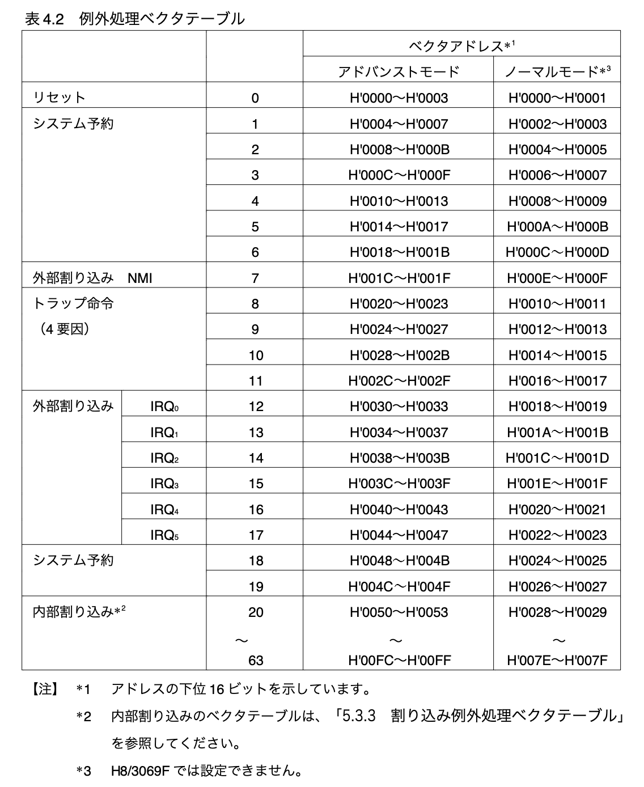

# 概要

- 7 章で実装した結果とそのプロセスにおいて気になった点を Log に残す。

## 本章で実装すること

- シリアル通信用の割り込みの機能の実装
  - bootloader が配置されている先頭領域の vectors と関連する関数の実装
  - 実際に呼び出される OS 側の割り込みハンドラの実装

## 実装した結果

- ...

## メモ

- 割り込み発生するとプログラムカウンタと CCR はスタックに退避される。(仕様)

### 汎用レジスタに関して

- -> ER0 ~ ER7 までが汎用レジスタである。ただし、ER7 には SP が入っている。

### vectors に関して

