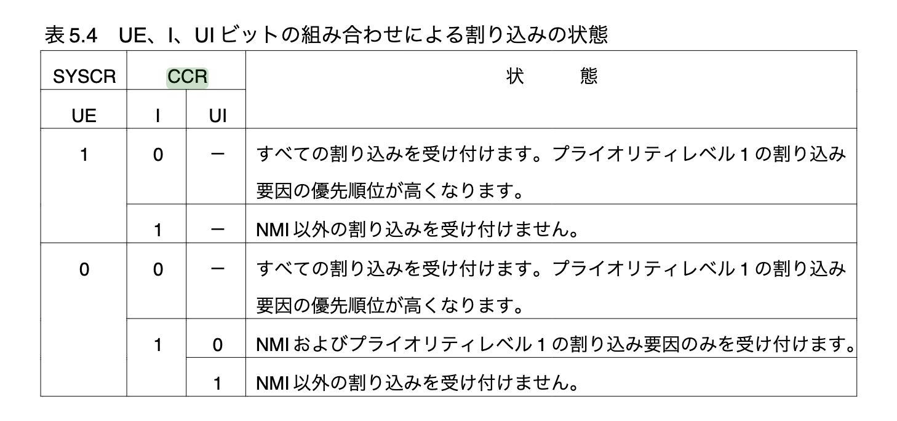

# 概要

- 9 章で実装した結果とそのプロセスにおいて気になった点を Log に残す。

## 本章で実装すること

- ...

## 実装した結果

- ...

## 今後の課題

- [ ] ...

## メモ

### 用語

- プリエンプティブ方式は、プリエンプションとも呼ばれ、実行中のタスクを中断しながら、別のタスクに CPU を割り当てて処理を行う方式です。

### 仕様書



### Dbug メモ

- 自分が紙の上で考えた処理の流れは大まかにはあっていた。(細かい部分は間違っていたが ...)

- OS 側の main.c の `INTR_ENABLE` を実行しなくても、スレッド自体は実行可能。(外部割り込みとかで重要となってくる処理なんかな？いまいちこの処理がない時の問題点がわからん。)
- OS 側の main.c の `kz_chpri(15);` を実行しないと、3 つのサンプルのスレッドは実行されない。(<- これは当たり前)
  - この中で最終的に呼ばれている `thread_intr` 内の `dispatch` を呼び出さないと、3 つのサンプルのスレッドは実行すらされない。(<- 想定通りだった。)
  - `kz_syscall` で呼び出される `asm volatile("trapa #0");` は最終的に bootloader 側の `interrupt` を呼び出す。OS 側の `interrupt` に Debug コードを仕込んでも出力されなかったのはこれのせい。最終的に呼び出されるハンドラ `SOFTVECS[type](type, sp)` (`SOFTVECS[type]` は存在している前提) は OS 側で `SOFTVECS` に定義される。
  - その定義箇所は

- OS 側の関数

```c
void kz_syscall(kz_syscall_type_t type, kz_syscall_param_t *param)
{
	current->syscall.type = type;
	current->syscall.param = param;
	if (type == KZ_SYSCALL_TYPE_CHPRI) {
		puts("in kz_syscall\n");
	}
	asm volatile("trapa #0");
}
```

- bootloader 側の関数

```c
void interrupt(softvec_type_t type, unsigned long sp)
{
  softvec_handler_t handler = SOFTVECS[type];
  if (handler)
    handler(type, sp);
}
```

- OS 側の関数

```c
void kz_start(kz_func_t func, char *name, int priority, int stacksize, int argc, char *argv[])
{
... (省略)
	setintr(SOFTVEC_TYPE_SYSCALL, syscall_intr);
	setintr(SOFTVEC_TYPE_SOFTERR, softerr_intr);
... (省略)
}
```

- OS 側の関数

```c
static int setintr(softvec_type_t type, kz_handler_t handler)
{
	static void thread_intr(softvec_type_t type, unsigned long sp);

	// SOFTVECS[type] に thread_intr を代入している。type は SOFTVEC_TYPE_SYSCALL と SOFTVEC_TYPE_SOFTERR である。
	softvec_setintr(type, thread_intr);

	// syscall_intr や softerr_intr を SOFTVEC_TYPE_SYSCALL や SOFTVEC_TYPE_SOFTERR の handlers に定義する。
	handlers[type] = handler;

	return 0;
}
```

- OS 側の関数

```c
int softvec_setintr(softvec_type_t type, softvec_handler_t handler)
{
	SOFTVECS[type] = handler;
	return 0;
}
```

- OS 側の関数

```c
static void thread_intr(softvec_type_t type, unsigned long sp)
{
	// kz_chpri を実行すると、この if 文を通る。
	if (type == SOFTVEC_TYPE_SYSCALL) {
		puts("in thread_intr from os\n");
		putxval(KZ_SYSCALL_TYPE_CHPRI, 0);
		puts("\n");
		putxval(type, 0);
		puts("\n");
		puts("in thread_intr from os\n");
	}

	current->context.sp = sp;

	// syscall_intr や softerr_intr を呼び出している。
	// syscall_intr が呼び出される場合は、システムコール (番号) に応じた current の処理が行われる。
	// softerr_intr が呼び出される場合は、exit する。
	if (handlers[type])
		handlers[type]();

	schedule();

	// これをコメントアウトしてみると、他のサンプルの 3 つのスレッドが実行されへん。
	dispatch(&current->context);
}
```

### thread_run　関数内の変数 thread_stack の値に関して

- 以下のように `thread_stack` の値が変化するかどうかを確認するための検証を行う。

```c
static kz_thread_id_t thread_run(kz_func_t func, char *name, int priority,
				 int stacksize, int argc, char *argv[])
{
	int i;
	kz_thread *thp;
	uint32 *sp;
	extern char userstack;
	static char *thread_stack = &userstack;

	puts("hoge\n");
	putxval(thread_stack, 0);
	puts("hoge\n");

... (省略)

  memset(thread_stack, 0, stacksize);
  thread_stack += stacksize;

  thp->stack = thread_stack;

... (省略)
}
```

- 結果

```bash
kzload> run
starting from entry point: ffc020
kozos boot succeed!
hoge
fff400hoge
hoge
fff500hoge
hoge
fff600hoge
hoge
fff700hoge
test09_1 started.
test09_1 sleep in.
test09_2 started.
test09_2 sleep in.
test09_3 started.
test09_3 wakeup in (test09_1).
test09_1 sleep out.
test09_1 chpri in.
test09_3 wakeup out.
test09_3 wakeup in (test09_2).
test09_2 sleep out.
test09_2 chpri in.
test09_1 chpri out.
test09_1 wait in.
test09_3 wakeup out.
test09_3 wait in.
test09_2 chpri out.
test09_2 wait in.
test09_1 wait out.
test09_1 trap in.
test09_1 DOWN.
test09_1 EXIT.
test09_3 wait out.
test09_3 exit in.
test09_3 EXIT.
test09_2 wait out.
test09_2 exit.
test09_2 EXIT.
Killed
```

- なお、以下の C 言語のプログラムでも検証してみた。

```c
#include <stdio.h>

static char userstack = 0x40;

void test()
{
	printf("userstack %x\n", userstack);
	static char *thread_stack = &userstack;
	printf("thread_stack %x\n", thread_stack);
	int stacksize = 0x10;
	thread_stack += stacksize;
}

int main(void)
{
	test();
	puts("=====");
	test();
}
```

- 結果

```bash
haytok@haytok-VJS132:~/workspace/marinOS$ gcc -o main main.c && ./main
userstack 40
thread_stack 55a03010
=====
userstack 40
thread_stack 55a03020
```

- -> 確かに `stacksize` の分だけ `thread_stack` の値が増えているのが確認できた。なお、`thread_stack` に `static` をつけないと、増えることはなかった。

- `static 修飾子`に関して

> ローカル変数は通常、関数呼び出しとともに生成され、returnされることで破棄されます。しかし、static付きのローカル変数は破棄されなくなります。

- [C言語 staticを変数と関数に付ける価値【保護の仕組みを解説】](https://monozukuri-c.com/langc-funclist-static/)

#### まとめ

- `thread_run 関数` 内の`変数 thread_stack` の値は `thread_run 関数` が呼び出されるたびにインクリメントされていき、別の領域のスタックが確保される。(これがわかったのはデカい。)
