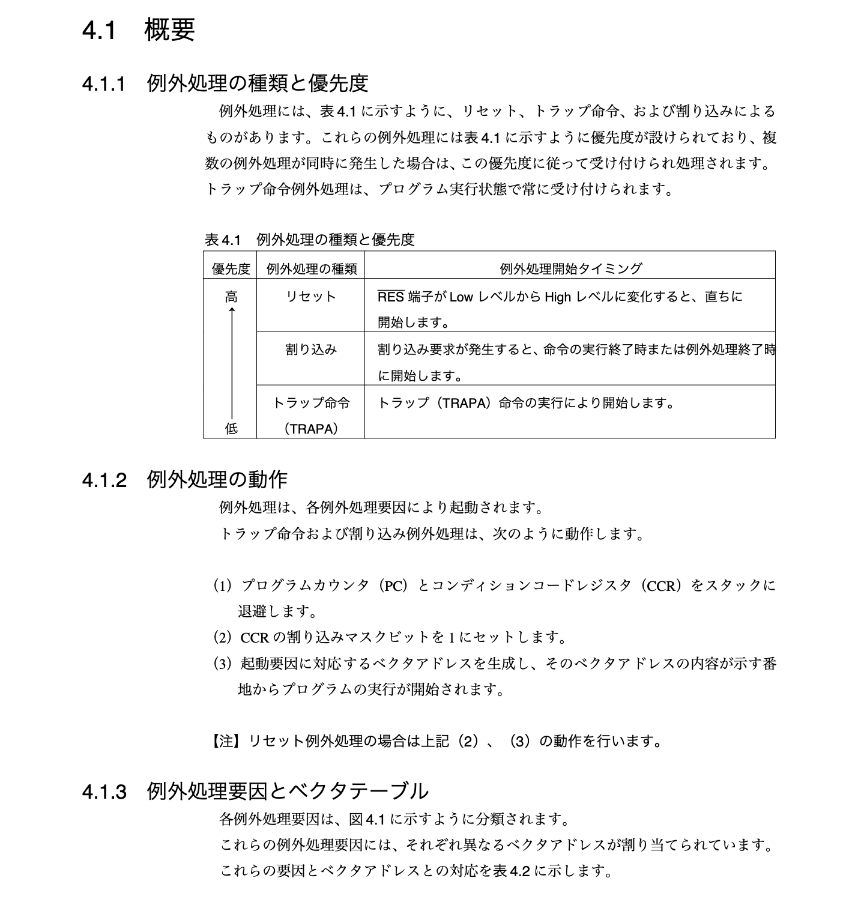

# 概要

- 12 章で実装した結果とそのプロセスにおいて気になった点を Log に残す。

## 本章で実装すること

- コマンド処理を割り込みを用いて処理をするように実装する。

## 実装した結果

```bash
boot loader> load

(Back at haytok-VJS132)
----------------------------------------------------
(~/workspace/marinOS/src/12/os/) C-Kermit>send marinos
Sending /home/haytok/workspace/marinOS/src/12/os/marinos, 49 blocks: Give your local XMODEM receive command now.
Bytes Sent:   6400   BPS:95

Transfer complete
(~/workspace/marinOS/src/12/os/) C-Kermit>c
Connecting to /dev/ttyUSB0, speed 9600
 Escape character: Ctrl-\ (ASCII 28, FS): enabled
Type the escape character followed by C to get back,
or followed by ? to see other options.
----------------------------------------------------

XMODEM receive succeeded :)
boot loader> run
starting from entry point:
ffc020
Boot Succeeded.
Started marinOS ...
Hello World :)
command> echo hello
 hello
command> echo haytok
 haytok
command> echo karin
 karin
command> exit
unknown.
command>
```

## 今後の課題

- [ ] switch case で処理を分岐させている箇所を配列を使用して実装し直す。
  - ref p.456
- [ ] すべてのテストプログラムを実行できるかどうかを試してみる。

## メモ

### サービスコールの呼び出しにおける注意点

- marinOS では割り込み処理中は割り込みが禁止になっている。
  - -> これってシステムコールなら `trapa` を使って処理を呼び出しているから？




- このドキュメントによると、

```
トラップ命令および割り込み例外処理は、次のように動作します。

（1）プログラムカウンタ（PC）とコンディションコードレジスタ（CCR）をスタックに
退避します。
（2）CCR の割り込みマスクビットを 1 にセットします。
（3）起動要因に対応 するベクタアドレスを生成し、そのベクタア ドレスの内容が示す番
地からプログラムの実行が開始されます。
```

```
ビット 7：割り込みマスクビット（ I）
本ビットが 1 にセットされると、割り込みがマスクされます。ただし、NMI は I ビット
に関係なく受け付けられます。例外処理の実行が開始されたときに 1 にセットされます。
```

```
表 5.4
...
```

-> トラップ命令および割り込み例外処理では、CCR の割り込みマスクビットに 1 がセットされる。これにより、基本的にはその例外処理に対して割り込みは発生しないものであると考えて良さそう。

### 非タスクコンテキストに関して

> 非タスクコンテキストはタスクコンテキストに含まれないコンテキストの総称で、割込みハンドラや CPU 例外ハンドラが含まれる。

- [ ITRON入門 周期ハンドラから学ぶ割り込み制御【CRE_CYC】](https://monozukuri-c.com/itron-cyclichandler/#toc7)

### 受信許可 bit に関して

- RIE が 1 の時は 受信データフル割り込み（RXI）要求、および受信エラー割り込み（ERI）要求を許可された状態である。
  - ref p.521 
